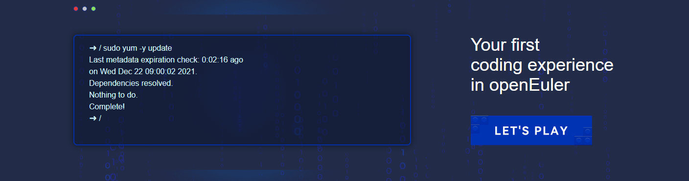
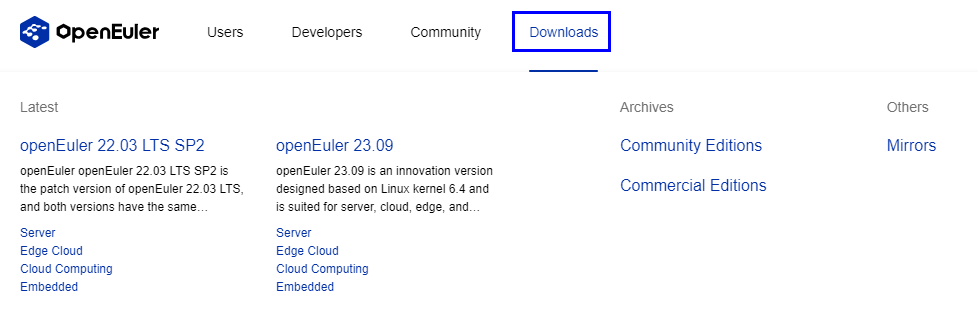
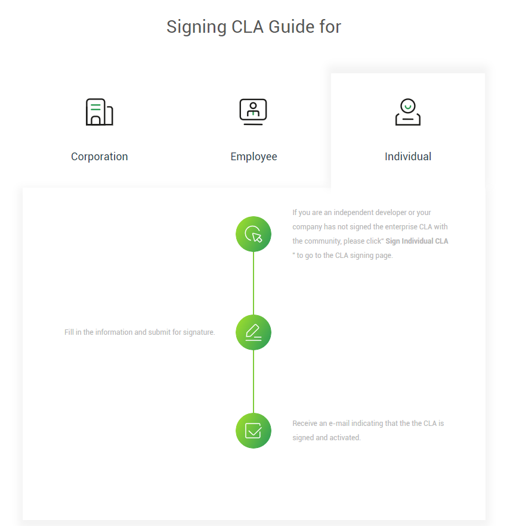

# openEuler Cookbook初稿1.0

👩‍🍳openEuler 101 - A Cookbook for Hungry Developers

### 👀Welcome to the openEuler Cookbook!

Hi curious developer, hungry to cook up some code masterpieces? This cookbook serves as your guide to whipping up creative solutions with openEuler.

What is openEuler, you ask? Simply put, it's an open source OS tailored for digital infrastructure. Just like Android powers your mobile apps and games, openEuler runs underneath servers and digital systems, serving as the core foundation. Think of openEuler as the core ingredient that adds flavor to your applications.

Born in 2019, openEuler quickly cultivated an active community with thousands of developers collaborating and innovating together. What makes this 4-year-old OS platform so appetizing? Let's have a taste...

* A Robust Technical Foundation

As a next-gen platform, openEuler offers both standard Linux and real-time kernels to support diverse environments. This flexibility lets you easily transfer apps from cloud to edge to IoT - a huge efficiency gain! openEuler also provides abundant toolchains, frameworks, and components for you to customize distros. You can combine different pieces like building with Lego blocks.

* A Nurturing Open Source Community

The openEuler community itself is a thriving open source ecosystem. Developers from leading companies, academia, and research institutes come together here to collaborate and share knowledge.

The community also employs structured mechanisms and processes to function smoothly. In openEuler, every industry peer work together on standards, and research findings easily transfer into industry. openEuler nurtures an environment for developers to learn and grow.

### 🍳Ready, Set, openEuler! 

 Before we start cooking, let's make sure we have all the ingredients. Here's what you need to do to get started:

### 🥕Shopping for Ingredients – Getting Started

Head over to the [openEuler website ](https://openeuler.org/)where you can find the download link, access various developer resources, experience innovative openEuler projects, connect with other open source enthusiasts, and more. It's the base camp, the headquarters, the mothership of openEuler. It's where you can find everything you need to start your open source adventure.

Like choosing between unsalted or salted butter, you can pick versions optimized for different architectures at [https://www.openeuler.org/zh/download/archive](https://www.openeuler.org/zh/download/archive). Grab the one that suits your needs and follow the installation instructions based on your hardware platform.

### 🥗Recipes

Now, you are ready to take the first bite of openEuler! Let's start cooking up some amazing projects. In this chapter, we'll explore different recipes for rustling up some open source creations.

### 🤗Recipe 1: Joining a SIG

The spice that gives openEuler its flavor is the community. The openEuler community is organized based on special interest groups (SIGs) to better manage and improve the work processes. Each SIG focuses on one or more specific areas or functions, such as kernel, security, container, database, etc. Registering with a SIG enables you to submit, discuss, and resolve issues with other members, as well as participate in reviews in a SIG repository. You can choose to join one or more SIGs according to your interests and expertise, and collaborate and communicate with like-minded developers. Check out the [SIG list](https://www.openeuler.org/en/sig/sig-list) to find one that matches your tastes. Or start a new SIG following the [hands-on instructions](https://www.openeuler.org/en/sig/sig-guidance).

### 🤖Recipe 2: Submitting issues

One of the most common ways to contribute to the openEuler community is to submit issues. An issue refers to a task to be completed. Such task can be a "problem", "requirement", or "suggestion". Issues are done through Gitee platform, which is like GitHub. You can view all openEuler project repositories at [https://gitee.com/openeuler](https://gitee.com/openeuler). If you are more comfortable with GitHub than Gitee, don't worry, we have you covered. openEuler has a mirror on [GitHub](https://github.com/openeuler-mirror), where also contains all the repositories. Submitting issues is a great way to improve openEuler, solve problems, and share your ideas. You can also get feedback and suggestions from other developers, and learn from their experience and expertise. So, don't be shy, submit your issues and let your voice be heard! And don't worry, we won't bite, unless you submit something really bad. Just kidding, we are nice and friendly, we promise.

### 👨‍💻Recipe 3: Submitting PRs

Better than just reporting bugs, offer fixes by submitting patches! If you have fixed a bug, added a feature, or improved a document in openEuler, you can submit a pull request (PR) to the community. A PR is a way of proposing a change, updating a code, or modifying a document. Submitting PRs can really help us smooth out the lumps in our community cake.

### 👜 Recipe 4: Contributing software packages

Another way to participate is by contributing software packages for openEuler. If you find that openEuler is missing any software package, you can contribute it to the openEuler community. First, you need to understand what is a Linux software package, and how to make a software package. Linux software package is a way of packaging software's source code, compilation scripts, configuration files, dependency relationships, and other information into a file, which is convenient for users to install and manage. 
Follow the following steps to add your flavorful contribution to the openEuler community:
1. Go to the [community repository](https://gitee.com/openeuler/community) and click **Fork**.
2. Clone the forked community repository to local.
3. Modify the community repository:
* Identify the SIG to which the software package belongs.
* Modify the contents under the SIG folder, such as the project list.
* Modify the **sig-info.yaml** under the relevant SIG folder, adding the new software package in the format "- src-openeuler/zip" to the corresponding SIG's list. Taking ZIP as an example, modify **sig/Base-service/sig-info.yaml**:
repositories:
- repo:
  - openeuler/openEuler-rpm-config
  - src-openeuler/abseil-cpp
  - src-openeuler/acl
  - src-openeuler/acpica-tools
  - src-openeuler/adcli
  - src-openeuler/aide
  - src-openeuler/airline
 
...
  - src-openeuler/jansson
  - src-openeuler/apr
  - src-openeuler/python-lxml
  - src-openeuler/zip
4. Create a new repository in **sig/{SIG directory}/src-openeuler/first letter of the software name** (For projects maintained by the openEuler community: openeuler directory; for packages from other communities: src-openeuler directory):
name: pkgname
description: about pkgname
upstream: https://somepkg.org/
branches:
- name: master
  type: protected
type: public
* Your task is to modify the files and then submit a PR. Explain clearly in the commit message why you are adding such a package or creating such a repository. The better your commit message, the easier it is to pass the review.
* Once the PR is merged, a repository with the same name will be created on Gitee. You can check the address at src-openeuler.
Contributing software packages enhances openEuler functionalities, making openEuler a software ecosystem with anything you need. You can also get recognition and appreciation from the community, and become a valuable contributor to openEuler. So, don't hesitate, contribute your software packages and let your work shine!

### 🎮Recipe 5: Developing new software

If you're feeling adventurous, it's time to unleash your creativity and develop a brand-new software for openEuler. Whether it's a useful tool, an exciting application, or a groundbreaking library, this recipe will guide you through the process of building and contributing your software to the openEuler distributions. Get ready to leave your mark on the openEuler universe!

* Developing outside the openEuler community: If you already have your own project on GitHub, GitLab, or Gitee, then you only need to add the software to the [src-openEuler](https://gitee.com/src-openeuler) repository.
* Developing in the openEuler community: Another method is to directly create a project in [https://gitee.com/openeuler](https://gitee.com/openeuler), and host your project to the openEuler community. If you have a great idea that you want to turn into a reality in the openEuler community, just follow the steps below:

1. Pitch your ideas to the Technical Committee on its regular meetings.
2. Once proved by the Technical Committee, set up your repository at [https://gitee.com/openeuler](https://gitee.com/openeuler) or [https://github.com/openeuler-mirror](https://github.com/openeuler-mirror).
3. Develop and incubate your project in openEuler until it matures.
4. Create a repository in [src-openeuler](https://gitee.com/src-openeuler) and provide an RPM file.
5. Celebrate your success! You have successfully completed your open source project in the openEuler community, and become a part of openEuler distros.

Developing new software is not only a way to innovate openEuler, create something unique and original, and express your vision and passion. It is also a way to challenge yourself, learn new things, and have fun.

### 📝Remember to stirring in CLA seasoning!

Although openEuler is an open source recipe, there are still important prep steps before you can start cooking! Contributor License Agreement (CLA) stipulates the terms of copyright, license, and liability that you need to abide by when submitting code or documents to the community as a contributor. Signing the CLA agreement can protect your intellectual property rights, as well as the interests and security of the community.

Signing the CLA agreement is as easy as pie. You only need to click **Developers** on the homepage, and then in the lower left corner of the drop-down box, find **CLA**, or directly visit [https://clasign.osinfra.cn/sign/gitee\_openeuler-1611298811283968340](https://clasign.osinfra.cn/sign/gitee\_openeuler-1611298811283968340).

You can choose to sign the individual CLA or the employee CLA according to your identity, and then follow the prompts to complete the signing process. After signing, you can officially become a member of openEuler community!

### 🎉More recipes on the way ...

Congratulations! 🤩

You've completed the openEuler Cookbook. We hope you've enjoyed these recipes and are now feeling confident and inspired to get involved with the openEuler community. Remember, this cookbook is just a starting point - let your creativity and passion guide you on this exciting openEuler journey. Happy coding, and may your projects be a feast for the senses!

### 💞Next up, your turn!

You think this is goodbye? Well, the mission doesn't end here. What's a cookbook without the continuous addition of new recipes over time?

openEuler is all about the spirit of open source - collaboration and sharing. Did you tweak a recipe to perfection? Come up with an original creation using openEuler? We'd love for you to submit your innovative recipes so we can share them with the community in upcoming cookbook volumes.

Let's keep cooking together to create a rich knowledge base for using openEuler!
