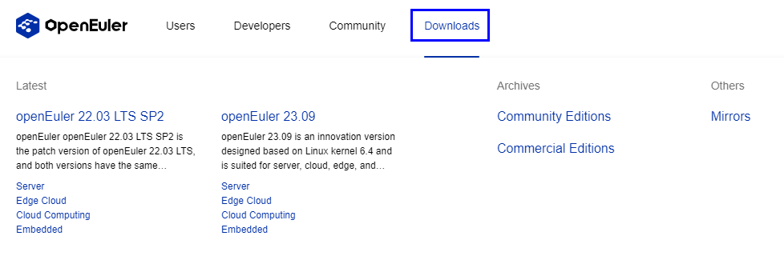

# 🍳 Ready, Set, openEuler!

Before we start cooking, let's make sure we have all the ingredients. Here's what you need to do to get started:

<figure><figcaption></figcaption></figure>

### 🥕Shopping for Ingredients – Getting Started

Head over to the [openEuler website ](https://openeuler.org/)where you can find the download link, access various developer resources, experience innovative openEuler projects, connect with other open source enthusiasts, and more. It's the base camp, the headquarters, the mothership of openEuler. It's where you can find everything you need to start your open source adventure.

<figure><figcaption>
Official website
</figcaption></figure>

Like choosing between unsalted or salted butter, you can pick versions optimized for different architectures at [the download page](https://www.openeuler.org/en/download/archive). Grab the one that suits your needs and follow the installation instructions based on your hardware platform.

<figure><figcaption>
Download
</figcaption></figure>
